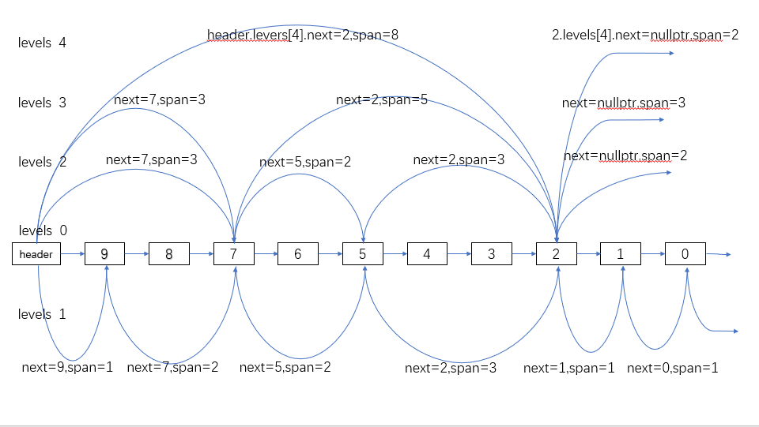

## 跳表 template<class K,class V,class H=std::hash(V)> class GameTools::RankSkipList
### 实现功能：  
**插入元素、更新元素**  <br>
```SkipListNode<K,V>* InsertOrUpdate(K key,V val)  ```

**删除元素** <br>
```bool DeleteNode(V val) //通过val删除元素```<br>
```  uint64_t DeleteNodeByRange(uint64_t start,uint64_t end) //删除第start个到第end个元素```

**查找元素**  <br>
```bool has(const V& val)```<br>
```int64_t Rank(const V& val) //查找val在跳表中的排名```

**跳表长度** <br>
```uint64_t length()```

**打印跳表结构** <br>
```void printSkipList()```


### 逻辑结构 通过k key实现有序排列，通过v val标识唯一元素
#### 例如:
Level 4: header->2<br>
Level 3: header->7->2<br>
Level 2: header->7->5->2<br>
Level 1: header->9->7->5->2->1->0<br>
Level 0: header->9->8->7->6->5->4->3->2->1->0<br>
#### 上层包含在下层中，每一层都是有序的,增删改查的时间复杂度为O(logn)
#### 元素所在层数随机，100%概率在第0层，50%概率在第1层，25%概率在第2层，12.5%概率在第3层，以此类推

### 存储结构
```
template<class K,class V>
struct SkipListNode{
K key;
V value;
SkipListNode* pre;//前节点
int32_t level;//层数
//每层节点信息
struct SkipListLevel{
SkipListNode<K,V> *next= nullptr; //下一个节点
uint64_t span=0;//span(跨度),当前层中此节点到下一个节点在整条链中相差的节点数量，相邻为1
};
//动态数组,levels[i]即第i层
std::unique_ptr<SkipListLevel[]> levels;
};
```

